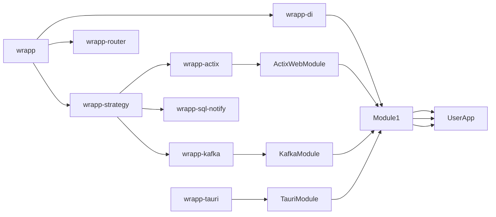

# Why?

Building systems which are more than one thing at once (e.g. A WebAPI + Kafka Consumer) often forces
developers to either build more bootstrapping glue or to accept their applications to look chaotic.

E.g., a typical multi-functional application might require:

1. Setting up a web server for API endpoints
2. Configuring Kafka consumers for message processing
3. Initializing database connections
4. Setting up background job schedulers
5. Implementing logging and monitoring systems

Each of these components often requires its own initialization logic, configuration management, and integration with the rest of the application. This can lead to:

- Complex and hard-to-maintain bootstrapping code
- Tight coupling between different parts of the application
- Difficulty in adding or removing features
- Challenges in testing individual components in isolation
- Inconsistent patterns across different parts of the system

These issues can significantly increase the cognitive load on developers and make the codebase harder to evolve over time.
The wrapp ecosystem aims to address these challenges by providing a modular and extensible framework for building multi-functional applications.

# How?

1. Modular Architecture: 
   Wrapp encourages breaking down the application into smaller, self-contained modules. Each module encapsulates a specific Domain (e.g. User, Todos, Metrics).
   Each domain on its own can then use one or multiple Strategies to define how it has to interact with the outside world.
   E.g. User could be an Actix and a Kafka module, thus getting input from these sources.
   
   This approach offers several advantages:
   - Improved maintainability: Each module can be developed, tested, and updated independently.
   - Flexibility: Domains can easily adopt new strategies or remove existing ones without affecting other parts of the system.
   - Scalability: As the application grows, new domains can be added as separate modules without disrupting existing functionality.
   - Reusability: Well-defined modules can be reused across different projects or shared within a larger ecosystem.

   The separation of domains and strategies allows for a clean architecture where business logic (domains) is decoupled from the technical implementation details (strategies), promoting better code organization and easier long-term maintenance.

# Goal of wrapp:
Create an ecosystem which allows applications to compose themselves of different logical modules.  
All modules share a DI framework, and strategies which determine how the outside world can interact with them.

The DI Framework will allow a Module to declare other Modules it depends on - being optional, required or lazily.  
The DI Framework will orchestrate the construction of all Modules, injecting dependencies as needed.

The strategy system will allow modules to bootstrap themselves to e.g. the Webserver started by the application, or the Kafka Cluster connected to the app.  
With the strategy system a module can declare itself as a WebModule (or probably more specific as an ActixModule, even though a general WebModule would be really cool).  
This WebModule could then declare it's own routes, handlers, middlewares etc. which if the Module is registerd will attach themselves to the Server.
Then the Module could also declare itself as a KafkaModule, or a PostgresNotifyModule or a GRPC module, or a GraphQLModule etc.

This way reusability components like a MetricsModule, a TaskQueueModule, and many more could be created which then
can simply be registered allowing their functionality work. 

To simplify the creation of Strategies Wrapp should also provide some useful tools. E.g. a simple Router which can be used to quickly build a new strategy.
In general it is a goal to make Strategies and Modules:
   1. As easy to implement as possible
   2. Backwards compatible for as long as possible

wrapp          - overarching framework  
wrapp-di       - DI framework  
wrapp-strategy - Trait for implementing new Strategies - e.g. a WebServer would be a strategy, or Listening to Kafka is a strategy
wrapp-router   - Optional component to use for strategies - could e.g. allow routing through proc macros, and extracting app state  

E.g.

wrapp-actixs implements wrapp-strategy  
wrapp-actixs thus has hooks to: collect all the routes and config it needs and start the actix server   
wrapp-actixs exports a trait wrapp-actix-module, which if implemented by a module, has the functions needed to collect all routes and config
since actix has it's own router, it will not use wrapp-router, but the wrapp-axtic strategy will add the finished DI container to actix's app state, and will provide an etractor like WrappState<Module>, to access data from the Wrapp-DI

or 

wrapp-kafka implements wrapp-strategy
wrapp-kafka has a hook to collect all routes for messages, and has an implementation to start clients to listen to kafka
it exports a trait wrapp-kafka-module, which if implemented...
since this does not have it's own router, it can opt in to use the wrapp router, automatically allowing it to use e.g. middlewares and injection on it's endpoints.

Possible Issues: 
1. Version conflicts
If module has serverely different versions of e.g. wrapp-actixs, this could lead to annoyances

