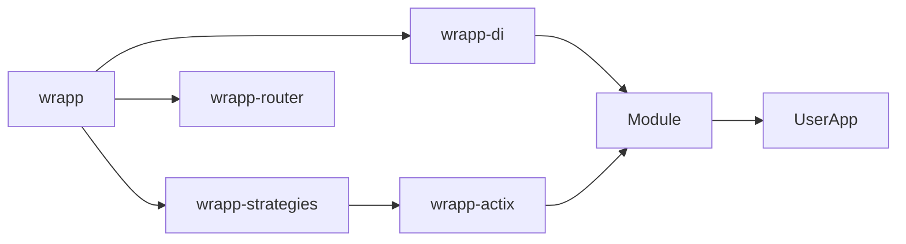

# Wrapp

**Create composable Rust Applications, cleanly separating business logic from infrastructure concerns.**

> ⚠️ **Work in progress / experimental.** Wrapp is in early development (`v0.0.0`). The API is incomplete, unstable, and changes frequently. It is **not** ready for production use. Expect things to break.

---

## Why?

Once an application exposes more than one interface, e.g. a web API, Kafka consumer, CLI, you usually end up writing bootstrapping code to wire everything together.

Each part needs its own setup, config, and wiring, often this leads to chaotic code and thus hard to maintain codebases.

Wrapp moves that wiring into reusable infrastructure so modules can focus on business logic.

Wrapp aims to make multi-functional applications **modular** by separating *what* your application does from *how* it talks to the outside world.

## Core idea

Wrapp takes care of the bootstrapping and wiring, so you can focus on your solutions.

It does this by providing three core concepts:

- **Modules** contain the logic of a domain (e.g. `User`, `Metrics`, `Health`).
- **Strategies** define how the outside world interacts with a module (e.g. an Actix web server or a Kafka consumer). A single module can opt into several strategies.
- A shared **DI (dependency injection)** framework wires everything together and constructs modules in the right order.
- Additional building blocks to simplify creating strategies


```mermaid
graph LR;
  wrapp --> wrapp-di
  wrapp --> wrapp-strategies
  wrapp --> wrapp-router
  wrapp-strategies --> wrapp-actix
  wrapp-di --> Module --> UserApp
  wrapp-actix --> Module
```

For the full design rationale see [`docs/idea.md`](docs/idea.md).
For a work in progress API sketch see [`examples/prototype`](examples/prototype).

### Non Goals

- Wrapp is **not** a framework for a specific domain (e.g. web)
- Wrapp is **not** a replacement for existing frameworks or libraries (e.g. Actix, Tokio, Kafka clients)
- Wrapp is **not** trying to be compile-time validated.

## Repository layout

```text
wrapp/            # umbrella crate 
features/
  wrapp-di/       # dependency injection
  wrapp-config/   # config injection
  wrapp-router/   # routing building block
  wrapp-strategies/ # strategy trait
strategies/       # contains strategies for different frameworks
  wrapp-actix/    
examples/
  prototype/      # design sketch of the target API
docs/             # scratchpad for ideas and roadmap
```

## Development

This is a Cargo workspace, so the usual commands work:

```sh
cargo build
cargo test --all
```

A helper script bundles the common checks (format, lint, doc, dependency audit, tests):

```sh
./check.sh        # run all checks
./check.sh fix    # auto-fix formatting/lints where possible
./check.sh help   # list available commands
```

The toolchain is pinned via [`rust-toolchain.toml`](rust-toolchain.toml).

## Roadmap

See [`docs/todo`](docs/todo).

## Contributing

Wrapp is in an exploratory phase, so designs and APIs are still in flux.
Issues and ideas are welcome - but expect significant churn before anything stabilizes.

## License

Licensed under either of

- Apache License, Version 2.0 (LICENSE-APACHE or <http://apache.org/licenses/LICENSE-2.0>)
- MIT license (LICENSE-MIT or <http://opensource.org/licenses/MIT>)

#### Contribution

Unless you explicitly state otherwise, any contribution intentionally submitted for inclusion in the work by you, as defined in the Apache-2.0 license, shall be dual licensed as above, without any additional terms or conditions.
